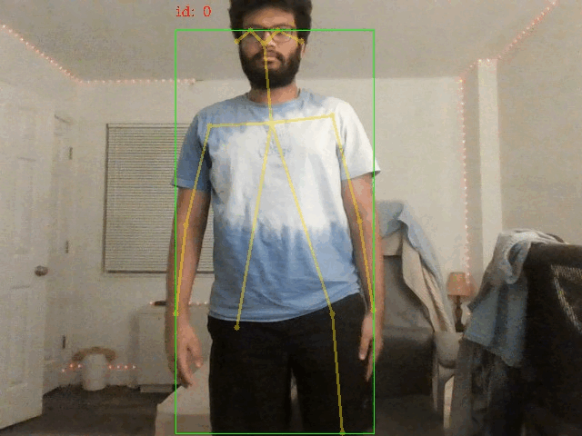

# 2D Multi-Person Pose Estimation on CPU

This repository contains training code for the paper [Real-time 2D Multi-Person Pose Estimation on CPU: Lightweight OpenPose](https://arxiv.org/pdf/1811.12004.pdf). This work is inspired from [LINK](https://github.com/Daniil-Osokin/lightweight-human-pose-estimation.pytorch). The  approach to reach real-time inference on CPU with negliable accuracy drop. It detects a skeleton (which consists of keypoints and connections between them) to identify human poses for every person inside the image. The pose may contain up to 18 keypoints: ears, eyes, nose, neck, shoulders, elbows, wrists, hips, knees, and ankles. On COCO 2017 Keypoint Detection validation set this code achives 40% AP for the single scale inference (no flip or any post-processing done). 

## Table of Contents

* [Requirements](#requirements)
* [Prerequisites](#prerequisites)
* [Validation](#validation)
* [Pre-trained model](#pre-trained-model)
* [Python demo](#python-demo)

## Requirements

* Python 3.6
* PyTorch

## Prerequisites

1. Download COCO 2017 dataset: [http://cocodataset.org/#download](http://cocodataset.org/#download) (train, val, annotations) and unpack it to `<COCO_HOME>` folder.
2. Install requirements `pip install -r requirements.txt`

## Validation

1. Run `python val.py --labels <COCO_HOME>/annotations/person_keypoints_val2017.json --images-folder <COCO_HOME>/val2017 --checkpoint-path <CHECKPOINT>`

## Pre-trained model

The model expects normalized image (mean=[128, 128, 128], scale=[1/256, 1/256, 1/256]) in planar BGR format.

#### Conversion to OpenVINO format

1. Convert PyTorch model to ONNX format: run script in terminal `python scripts/convert_to_onnx.py --checkpoint-path <CHECKPOINT>`. It produces `human-pose-estimation.onnx`.
2. Convert ONNX model to OpenVINO format with Model Optimizer: run in terminal `python <OpenVINO_INSTALL_DIR>/deployment_tools/model_optimizer/mo.py --input_model human-pose-estimation.onnx --input data --mean_values data[128.0,128.0,128.0] --scale_values data[256] --output stage_1_output_0_pafs,stage_1_output_1_heatmaps`. This produces model `human-pose-estimation.xml` and weights `human-pose-estimation.bin` in single-precision floating-point format (FP32).

## Python Demo

We provide python demo just for the quick results preview. Please, consider c++ demo for the best performance. To run the python demo from a webcam:
* `python demo.py --checkpoint-path <path_to>/checkpoint_iter_370000.pth --video 0`

## Demo

#